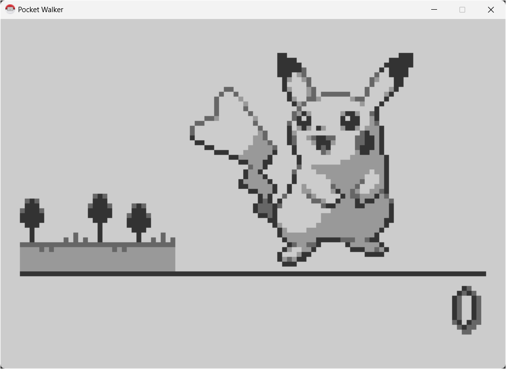

<div align="center">

PocketWalker - An H8/300H Emulator Tailored for the PokeWalker
------------------------------------------
[]()
[]()

</div>



## Building PocketWalker
To build PocketWalker from source, first clone the repository and all of its submodules.
```
git clone -b feature/cmake https://github.com/h4lfheart/PocketWalker --recursive
```

Then open the project directory in a terminal window and build.
```
./build.sh
```

## Fully Implemented Features
- CPU
- SSU
- RTC
- SCI3 ([melonDS-IR](https://github.com/Ceravia/melonDS-IR))
  - Peer Play
- Peripherals
  - LCD (w/ Sleep Mode)
  - Eeprom
  - 3-Button Input
  - Beeper Audio

## Partially Implemented Features
- ADC (Fake Values)
- Accelerometer (No Step Tracking Yet)

## Planned Features
- Step Tracking (Accelerometer)
  - Gifts
